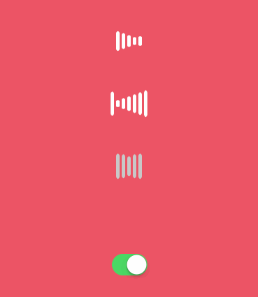
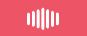

# HLBarIndicatorView

[](https://travis-ci.org/PandaApe/HLBarIndicatorView)
[](http://cocoapods.org/pods/HLBarIndicatorView)
[](http://cocoapods.org/pods/HLBarIndicatorView)
[](http://cocoapods.org/pods/HLBarIndicatorView)

## Example



## Requirements

- Swift 3.0
- iOS 8.0+
- Xcode 8.0

## Installation

***CocoaPods(recommend):***

HLBarIndicatorView is available through [CocoaPods](http://cocoapods.org). To install
it, simply add the following lines to your Podfile:

```ruby
platform :ios, '8.0'
use_frameworks!

pod "HLBarIndicatorView"

```
To get the full benefits import HLBarIndicatorView wherever you import UIKit:

```swift
import UIKit
import HLBarIndicatorView
```

***Manually***

1. Download and drop ```HLBarIndicatorView.swift``` in your project.
2. Congratulations!


## Usage example

Inited from pure code ：

```swift
 let indicatorView = HLBarIndicatorView(frame: CGRect(x: 0, y: 40, width: UIScreen.main.bounds.width, height: 80))

 indicatorView.indicatorType = .barScaleFromRight
 self.view.addSubview(indicatorView)
```

HLBarIndicatorView also supports loading from ```Xib```

### Customization Properties

| property | default value | remark |
|------|----|---|
|open var barsCount:Int	|5| bar的数量, Must be an ODD Int value |
|open var indicatorType: HLBarIndicatorType| HLBarIndicatorType.barScalePulseOut| provides 3 kinds of styles|
|open var maxBarHeight: CGFloat |40.0| 最大高度|        
|open var minBarHeight: CGFloat   |10.0|  最小高度|           
|open var barWidth: CGFloat   |5.0|  Bar 的宽度|               
|open var barsGapWidth: CGFloat   |3.0|  bar之间的间隔           
|open var barCornerRadius: CGFloat   |5.0|  圆角|        
|open var animationDuration: CFTimeInterval |0.8|执行一次动画所需要的时间
|open var barColor: UIColor  |UIColor.white| Bar的颜色 |

#### HLBarIndicatorType:

***case .barScalePulseOut:***


***case .barScaleFromRight:***


***case .barScaleFromLeft:***




### Public Methods

```swift
 open func startAnimating()
 open func pauseAnimating()
```

## Author

pandaApe, whailong2010@gmail.com

## License

HLBarIndicatorView is available under the MIT license. See the LICENSE file for more info.
