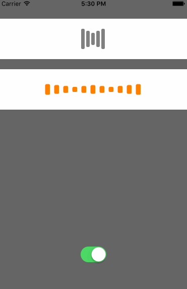

# HLBarIndicatorView

[](https://travis-ci.org/PandaApe/HLBarIndicatorView)
[](http://cocoapods.org/pods/HLBarIndicatorView)
[](http://cocoapods.org/pods/HLBarIndicatorView)
[](http://cocoapods.org/pods/HLBarIndicatorView)

## Example



## Requirements

## Installation

HLBarIndicatorView is available through [CocoaPods](http://cocoapods.org). To install
it, simply add the following line to your Podfile:

```ruby
pod "HLBarIndicatorView"
```

## Author

PandaApe, whailong2010@gmail.com

## License

HLBarIndicatorView is available under the MIT license. See the LICENSE file for more info.
